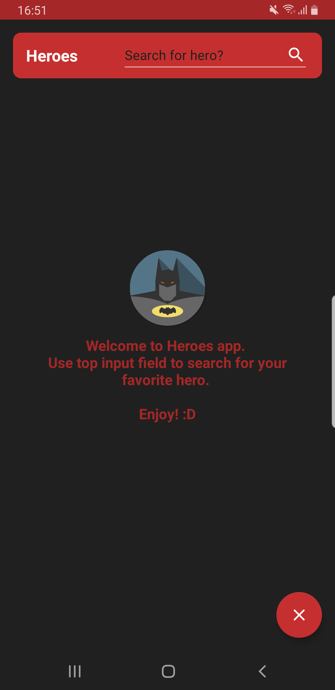
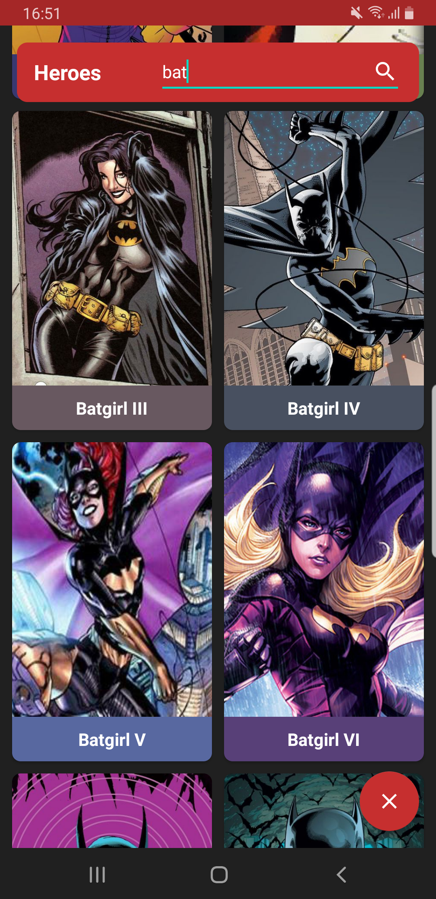
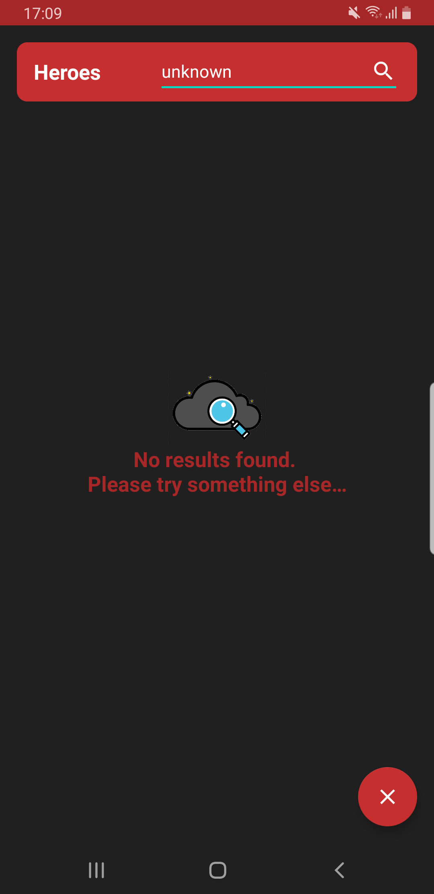
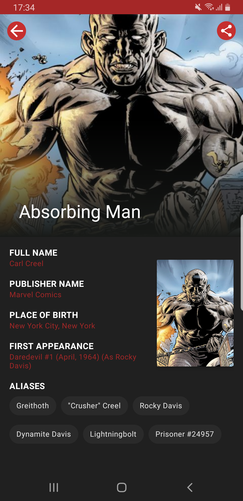
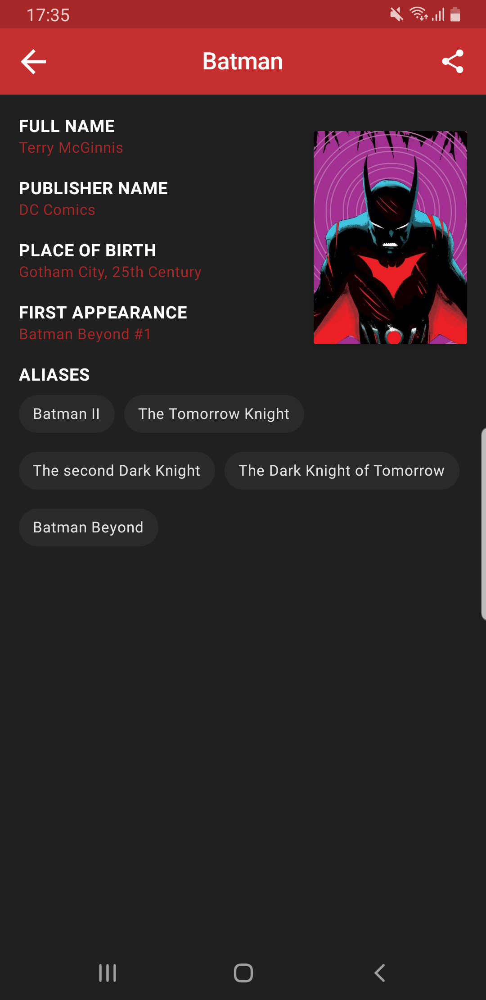
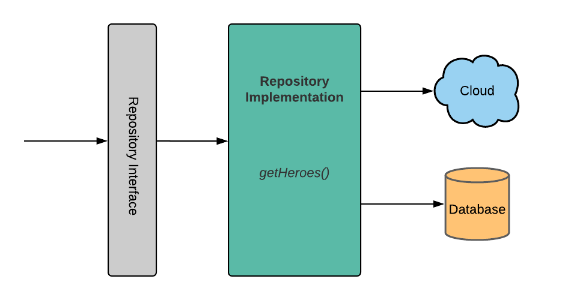

Heroes (android mobile app)
=================

Heroes app illustrating Android development best practices with Android Jetpack.

Getting Started
---------------

### Android Studio IDE setup
For development, the latest version of Android Studio is required.
The latest version can be downloaded from [here](https://developer.android.com/studio/).

This project uses the Gradle build system.
To build this project, use the `gradlew build` command or use `Build` command in Android Studio.

### Coding style
App uses [Square](https://github.com/square/java-code-styles) coding styles.
[Here's](https://github.com/square/java-code-styles/blob/main/README.md) how to configure it for use with Android Studio (instructions adapted from Sqaure README)

### SuperHero API key
App uses [SuperHero API](https://superheroapi.com/) to load superheroes.
To use the API, you will need to obtain a free developer API key.
See the [SuperHere API Documentation](https://superheroapi.com/) for instructions.

Once you have the key, add this line to the `config.xml` file

```
<string name="heroes_api_key">your SuperHero access key</string>
```

Screenshots
-----------



Architecture
--------------
**Model–View–ViewModel (MVVM)** is a software design pattern that is structured to separate program logic and user interface controls. MVVM is also known as model-view-binder and was created by Microsoft architects Ken Cooper and John Gossman. Like many other design patterns, MVVM helps organize code and break programs into modules to make development, updating and reuse of code simpler and faster. The pattern is often used in Windows and web graphics presentation software.


**Repository modules** handle data operations. They provide a clean API so that the rest of the app can retrieve this data easily. They know where to get the data from and what API calls to make when data is updated. You can consider repositories to be mediators between different data sources, such as persistent models, web services, and caches.



Libraries
--------------
* [Retorift](https://github.com/square/retrofit) Used for API requests
* [Room](https://developer.android.com/topic/libraries/architecture/room) Used for database
* [Dagger 2](https://github.com/google/dagger) Used for dependency injection
* [ViewModel](https://www.google.com/aclk?sa=l&ai=DChcSEwjF_9mdi9rsAhWFGHsKHfBeCUMYABAAGgJsZQ&sig=AOD64_3JpFaMS2BFPlkU6waX4Jkw3UVD1g&q&adurl&ved=2ahUKEwil39Cdi9rsAhUK_CoKHaWPDa8Q0Qx6BAgwEAE) Store UI-related data that isn't destroyed on app rotations. Easily schedule asynchronous tasks for optimal execution
* [Glide](https://github.com/bumptech/glide) Used for image loading
* [Navigation](https://developer.android.com/guide/navigation/navigation-getting-started) Handle everything needed for in-app navigation
